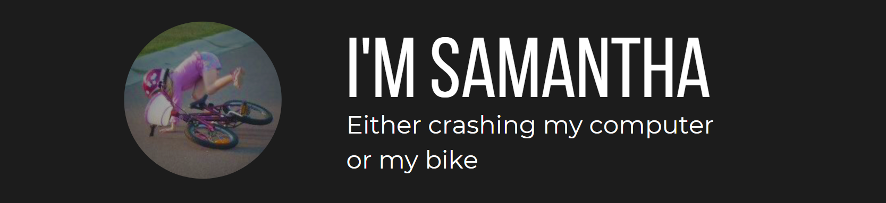

## Hello! 👋

I'm a second-year mechanical engineering and compsci student at **UNSW** and a junior developer at **NUKON** where I've had the opportunity to work on SCADA systems and get involved in real-world software development projects. 
Whenever else I can, I'm a Freelance Developer. 

### Projects in Motion 🌀

- **Freelance Website Overhaul:** I'm currently working on a complete website overhaul, covering everything from designing its look and feel to building and testing. 
- **Cross-Platform Calendar:** A calendar application that will serve as a conglomerate of my organisational diaries - without all the extra clutter and frills in the latest scheduling applications. 
- **IDE Overlay Application:** 
