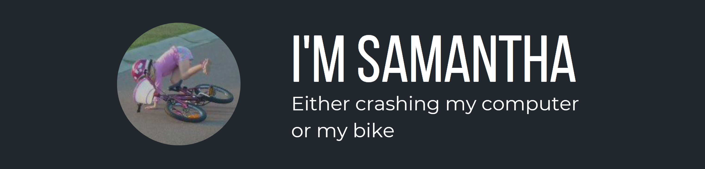

## Welcome to My Fullstack Journey! 👋

I'm a second-year mechanical engineering and compsci student at **UNSW** and a junior developer at **NUKON** where I've had the opportunity to work on SCADA systems and get involved in real-world software development projects. 
Whenever else I can, I'm a Freelance Developer. 

## 🌀 Projects in Motion 

- Freelance Website Overhaul
- Cross-Platform Calendar
- IDE Overlay Application

## 🚀 Other interests 
